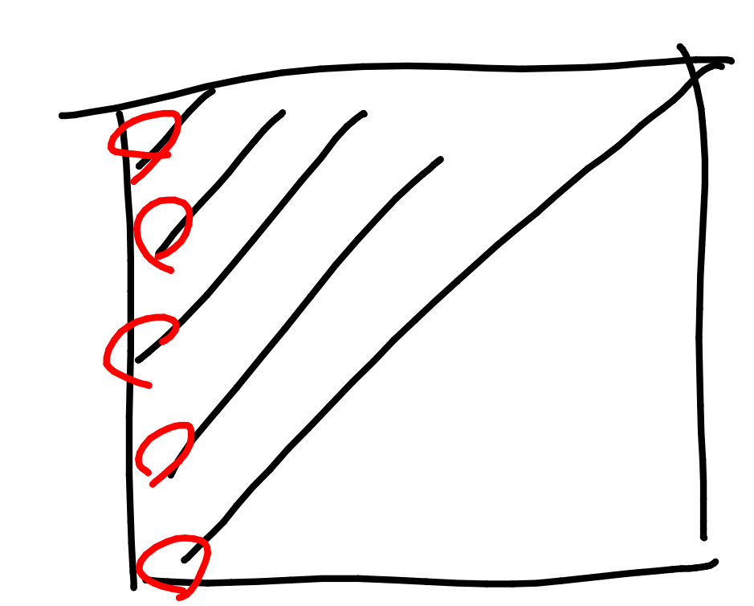
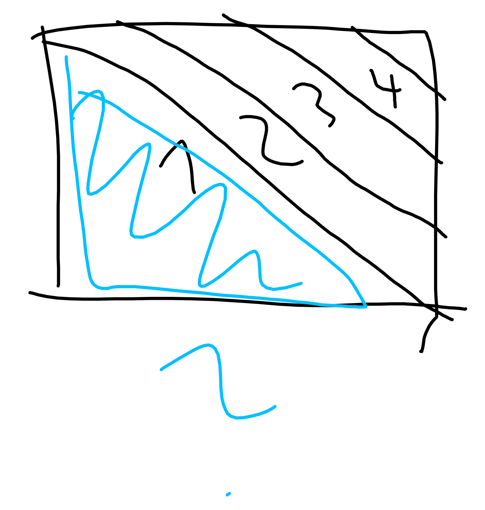
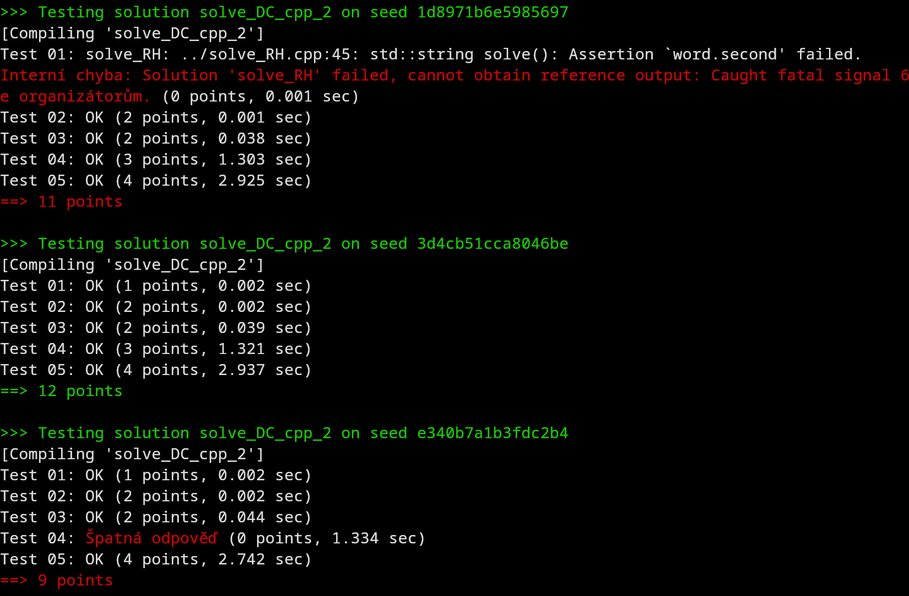

# Some bits from discord debug conversation that has more then 250 messages

Firstly someone pointed out it is a Beginners category so we should make it easier. So it should
just be a one way word search puzzle(jednosměrka :D).

 


Rubber ducking with Ríša and Vladimír:

```plaintext
Vladimír: For each word I remember the coordinates where it lies. Then I turn on aho corrasic and it finds out if any word is lying wrong. If so, it is written to the words to be deleted. I feed aho corrasic with rows, columns and then all diagonals. When aho-corrasic finishes, the algorithm for deleting words from the entire crossword takes place. Then I try to solve the crossword with a fast solver. I find out which words are redundant and delete them from the list of words that I print to the participants. (This is a bug detection 1 word does not delete from all parts where it should be deleted and remains there)

Ríša: The last step seems a bit sus to me, like it is a patch, but it doesn't solve the whole problem.

Vladimír: I think that problem lies somewhere in calculation of diagonals, to me it looks just made up.
```

Images how not to calculate diagonals:

   


```plaintext
Three days before the release:
Vladimír: Status update task gives wrong output with probability 1/8000. It will stay like this if I don't find time to fix it but we agreed that it is okay to leave it like that.

Other person: Can the generator at least detect these cases?

Vladimír: Not yet...
```

```plaintext
Day before the release 11:29PM:
```
 

```plaintext
Ríša: aaa

Daniel: Uh oh

Ríša: Looks like two independent errors 😄
      Ah it looks like a "#" slipped in there an easy fix

Vladimír: ah, I see, at the end we need to add a check if all # were removed

Ríša: but it is sus, I would expect that if it removed q and w (or whatever), it would work on # too

Vladimír: yeah but # are generated different way and I forgort to add the check

Ríša: I see and the second bug 
```

> neboli sankovani rizky? budou zve Klan Babicko vas na Pstrosu Slonovitych kdy KSP

> o t a neboli sankovani rizky? budou zve Klan Babicko vas na Pstrosu Slonovitych kdy KSP 

```plaintext
Ríša: and now grandma help us(translation mistake original: a teď babo raď)

      aah it looks like that tester solution ends the checks after the first occurrence of the word

Vladimír: umm I see so generator is fine, I'm glad I don't need to do anything
          Now we are done finished just in time

```